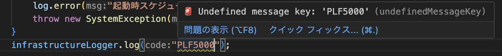
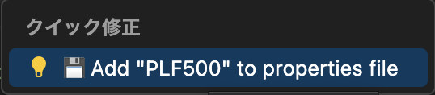
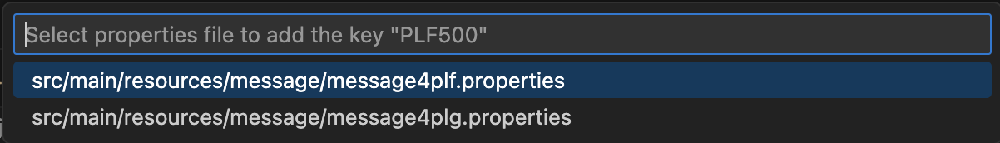
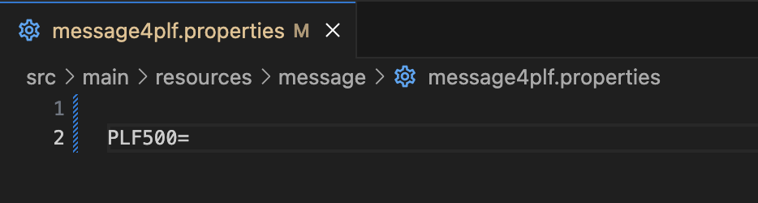
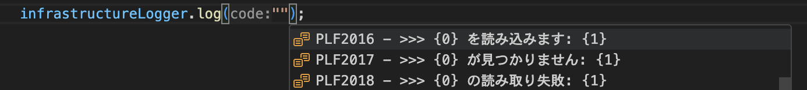

# Java Message Key Navigator

**Java Message Key Navigator** is a VS Code extension designed to supercharge your Java internationalization (I18N) workflow. Hover over any I18N method call to instantly preview the corresponding value from your `.properties` files, and use ⌘/Ctrl + click to jump straight to its definition. When a key is missing, you’ll see an automatic warning plus a one-click quick fix that inserts the new key in the correct sorted order—no more manual file edits or guesswork. With customizable extraction patterns and support for multiple property-file globs, this extension keeps your message keys organized and your development flow uninterrupted.


---

## 🚀 Key Features

This extension provides powerful features to streamline your Java internationalization workflow:

**Hover Previews**
Place your cursor on any call like

```java
infrastructureLogger.log("PLF1001");
```

and instantly see the localized message inline.

**Go to Definition**
Use ⌘ Click (macOS) or Ctrl Click to jump directly to the line in your `.properties` file where the key is defined.

**Undefined Key Detection & Quick Fixes**
When you use a key that doesn’t exist in any of your `.properties` files, a warning will appear automatically. The extension offers a quick fix that:

1. Resolves your property file globs or paths to actual `.properties` files.
2. Reads each file line by line, strips comments and blank lines, and builds a list of existing keys.
3. Checks for duplicate keys, aborting with a warning if the key already exists.
4. Determines the correct insertion position by finding the first existing key lexicographically greater than your new key — for example, inserting `PLF4997` before `PLF4998` if needed.
5. Splices the new key-value entry into the file, rewrites the file in one go, reopens it, and moves your cursor directly to the inserted line.
6. If multiple `.properties` files are present, prompts you with a dialog so you can select which file to add the new key to, giving you precise control over key organization.

**Custom Extraction Patterns**
You can configure your own regular expressions for detecting message key invocations, e.g.:

```json
"java-message-key-navigator.messageKeyExtractionPatterns": [
  "infrastructureLogger\\.log",
  "appLogger\\.warn"
]
```

**Multi-File Support**
The extension supports multiple `.properties` files specified using glob patterns, for example:

```json
"java-message-key-navigator.propertyFileGlobs": [
  "src/main/resources/message*.properties",
  "src/main/resources/validation/**/*.properties"
]
```

**Placeholder Count Validation**  
Detects when the number of `{0}`, `{1}`, … placeholders in your `.properties` value does not match the number of arguments you pass in code.  
- 🔍 Supports array literals like `new Object[] {…}`, `new String[] {…}`, etc.  
- 🔍 Also supports varargs calls such as  
   ```java
   infrastructureLogger.log("KEY", arg1, arg2, …);
   ```  
- ❌ Highlights any mismatch with a red squiggly underline in the editor for immediate correction  

**Annotation Key Extraction**  
Define regular-expression patterns to pull keys out of annotation attributes. For example, to treat the `start`, `end` and `exception` values in your
`@LogStartEnd(start="…", end="…", exception="…")` annotation as message keys:

```jsonc
"java-message-key-navigator.annotationKeyExtractionPatterns": [
  "@LogStartEnd\\(\\s*start\\s*=\\s*\"([^\\\"]+)\"",
  "@LogStartEnd\\(.*?end\\s*=\\s*\"([^\\\"]+)\"",
  "@LogStartEnd\\(.*?exception\\s*=\\s*\"([^\\\"]+)\""
]
```

## ⚙️ Configuration

Add these to your **User** or **Workspace** `settings.json`:

```jsonc
{
  // Which method calls carry your I18N keys (regex)
  "java-message-key-navigator.messageKeyExtractionPatterns": [
    "infrastructureLogger.log",
    "appLogger.warn"
  ],

  // Which .properties files to read & write (glob patterns)
  "java-message-key-navigator.propertyFileGlobs": [
    "src/main/resources/message*.properties",
    "src/main/resources/validation/**/*.properties"
  ]

  // Patterns to extract I18N keys from @LogStartEnd(start="…", end="…", exception="…") annotation
  "java-message-key-navigator.annotationKeyExtractionPatterns": [
    "@LogStartEnd\\(\\s*start\\s*=\\s*\"([^\\\"]+)\"",
    "@LogStartEnd\\(.*?end\\s*=\\s*\"([^\\\"]+)\"",
    "@LogStartEnd\\(.*?exception\\s*=\\s*\"([^\\\"]+)\""
  ]
}
```

| Setting                                   | Description                                                                                                    |
| ----------------------------------------- | -------------------------------------------------------------------------------------------------------------- |
| `messageKeyExtractionPatterns` (array)    | Regex patterns for method calls to scan for keys                                                               |
| `annotationKeyExtractionPatterns` (array) | Regex patterns for annotations to scan for keys (e.g. values of `start`, `end`, `exception` in `@LogStartEnd`) |
| `propertyFileGlobs` (array)               | Glob patterns for your `.properties` files to include in look-up and auto-insertion                            |

---

## 📖 Usage

1. **Hover**  
   Hover over any supported method call to see the message value inline.

2. **Definition**  
   ⌘ Click / Ctrl Click to jump to the exact line in the `.properties` file.

3. **Quick Fix**  
   When you see “Undefined message key” warnings, click the lightbulb or press `⌨️ Cmd/Ctrl + .` to add the missing key in the correct sorted position of your chosen file.

4. **Choose Target Property File**  
   If multiple property files are available, a dialog will appear letting you select which file the new key should be added to. This helps you manage multiple `.properties` files without manually editing each one.

   

   

   

   

5. **Completion for Existing Keys**  
   As you type inside supported method calls, existing keys are suggested as completion candidates, letting you quickly select an existing key.

   

---

## 🛠 Maintenance

1. **Clone & install**

   ```bash
   git clone https://github.com/y-ok/java-message-key-navigator.git
   cd java-message-key-navigator
   npm install
   ```
2. **Build & package**

   ```bash
   npm run build
   ```
3. **Run in VS Code**

   * Open this folder in VS Code
   * Press **F5** to launch a fresh Extension Development Host
4. **Or install the VSIX**

   ```bash
   code --install-extension java-message-key-navigator-(version).vsix
   ```

---

## 🛡 License

This project is released under the [MIT License](LICENSE).
Feel free to fork, adapt, and share!

---

## Credits

This extension is a fork of [TOMATOofGOHAN/java-i18n-ally](https://github.com/TOMATOofGOHAN/java-i18n-ally) (MIT License).
Thank you [TOMATOofGOHAN](https://github.com/TOMATOofGOHAN) for the original work!
