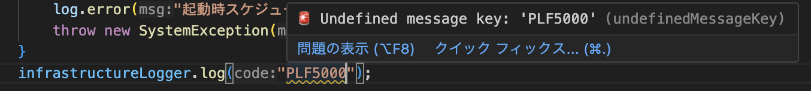
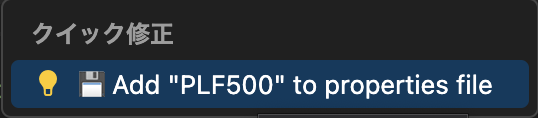
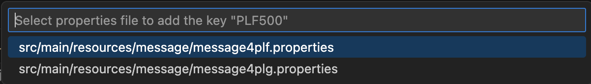
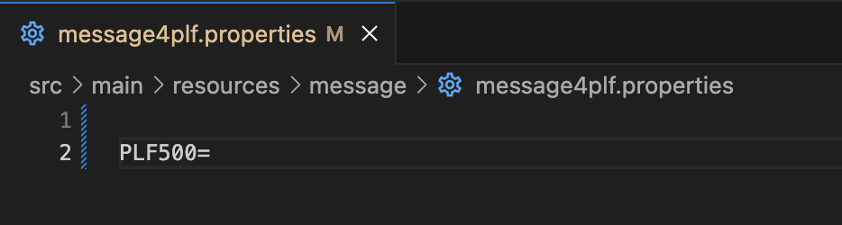
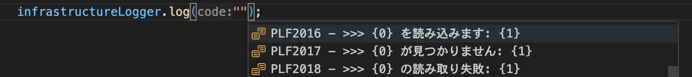

# Java Message Key Navigator

[](https://github.com/y-ok/java-message-key-navigator/releases)
[](https://github.com/y-ok/java-message-key-navigator/actions/workflows/ci.yml)
[](https://codecov.io/gh/y-ok/java-message-key-navigator)

**Java Message Key Navigator** is a VS Code extension designed to supercharge your Java internationalization (I18N) workflow. Hover over any I18N method call to instantly preview the corresponding value from your `.properties` files, and use ⌘/Ctrl + click to jump straight to the exact message-key definition. When a key is missing, you’ll see an automatic warning plus a one-click quick fix that inserts the new key in the correct sorted order—no more manual file edits or guesswork. With customizable extraction patterns and support for multiple property-file globs, this extension keeps your message keys organized and your development flow uninterrupted.

---

## 🚀 Key Features

This extension provides powerful features to streamline your Java internationalization workflow:

**Hover Previews**
Place your cursor on any call like

```java
infrastructureLogger.log("PLF1001");
```

and instantly see the localized message inline.

**Go to Definition**
Use ⌘ Click (macOS) or Ctrl Click to jump directly to the exact message key in your `.properties` file.

**Undefined Key Detection & Quick Fixes**
When you use a key that doesn’t exist in any of your `.properties` files, a warning will appear automatically. The extension offers a quick fix that:

1. Resolves your configured `propertyFileGlobs` to actual `.properties` files.
2. Reads each file line by line, strips comments and blank lines, and builds a list of existing keys.
3. Checks for duplicate keys, aborting with a warning if the key already exists.
4. Determines the correct insertion position by finding the first existing key lexicographically greater than your new key — for example, inserting `PLF4997` before `PLF4998` if needed.
5. Splices the new key-value entry into the file, rewrites the file in one go, reopens it, and moves your cursor directly to the inserted line.
6. If multiple `.properties` files are present, prompts you with a dialog so you can select which file to add the new key to, giving you precise control over key organization.

**Custom Extraction Patterns**
You can configure method call identifiers used to detect message-key invocations, e.g.:

```json
"java-message-key-navigator.messageKeyExtractionPatterns": [
  "infrastructureLogger.log",
  "appLogger.warn"
]
```

Hover, Go to Definition, and undefined-key validation also recognize
`messageSource.getMessage(...)` automatically.
Completion and placeholder validation use only the patterns you configure.

**Multi-File Support**
The extension supports multiple `.properties` files specified using glob patterns, for example:

```json
"java-message-key-navigator.propertyFileGlobs": [
  "src/main/resources/message*.properties",
  "src/main/resources/validation/**/*.properties"
]
```

**Placeholder Count Validation**  
Detects when the number of `{0}`, `{1}`, … placeholders in your `.properties` value does not match the number of arguments you pass in code.

- 🔍 Supports array literals like `new Object[] {…}`, `new String[] {…}`, etc.
- 🔍 Also supports varargs calls such as

  ```java
  infrastructureLogger.log("KEY", arg1, arg2, …);
  ```

- 🔍 Treats common exception arguments (e.g. `e`, `ex`, `exceptionObj`) as non-placeholder arguments in logger-style calls
- 🔍 Recognizes argument-builder methods configured via `argBuilderPatterns` (see [Configuration](#%EF%B8%8F-configuration))

  ```java
  // With argBuilderPatterns: [{ "pattern": "buildArgs", "argCount": 1 }]
  // message.properties: PLF1032=Request URI: {0}
  // → 1 placeholder matches argCount 1 ✅
  infrastructureLogger.log("PLF1032", buildArgs(requestUri));
  ```

- ❌ Highlights any mismatch with a red squiggly underline in the editor for immediate correction

**Annotation Key Extraction**  
Define regular-expression patterns to pull keys out of annotation attributes. For example, to treat the `start`, `end` and `exception` values in your
`@LogStartEnd(start="…", end="…", exception="…")` annotation as message keys:

```jsonc
"java-message-key-navigator.annotationKeyExtractionPatterns": [
  "@LogStartEnd\\(\\s*start\\s*=\\s*\"([^\\\"]+)\"",
  "@LogStartEnd\\(.*?end\\s*=\\s*\"([^\\\"]+)\"",
  "@LogStartEnd\\(.*?exception\\s*=\\s*\"([^\\\"]+)\""
]
```

## ⚙️ Configuration

Add these to your **User** or **Workspace** `settings.json`:

```jsonc
{
  // Which method calls carry your I18N keys (method identifier strings)
  "java-message-key-navigator.messageKeyExtractionPatterns": [
    "infrastructureLogger.log",
    "appLogger.warn",
  ],

  // Which .properties files to read & write (glob patterns)
  "java-message-key-navigator.propertyFileGlobs": [
    "src/main/resources/message*.properties",
    "src/main/resources/validation/**/*.properties",
  ],

  // Regex patterns to extract I18N keys from @LogStartEnd(start="…", end="…", exception="…") annotation
  "java-message-key-navigator.annotationKeyExtractionPatterns": [
    "@LogStartEnd\\(\\s*start\\s*=\\s*\"([^\\\"]+)\"",
    "@LogStartEnd\\(.*?end\\s*=\\s*\"([^\\\"]+)\"",
    "@LogStartEnd\\(.*?exception\\s*=\\s*\"([^\\\"]+)\"",
  ],

  // Methods that build argument arrays with a known argument count
  "java-message-key-navigator.argBuilderPatterns": [
    { "pattern": "buildArgs", "argCount": 1 },
    { "pattern": "createLogParams", "argCount": 2 },
  ],
}
```

| Setting                                   | Description                                                                                                                                                |
| ----------------------------------------- | ---------------------------------------------------------------------------------------------------------------------------------------------------------- |
| `messageKeyExtractionPatterns` (array)    | Method identifier strings used to detect target calls (e.g. `infrastructureLogger.log`)                                                                    |
| `annotationKeyExtractionPatterns` (array) | Regex patterns for annotations to scan for keys (e.g. values of `start`, `end`, `exception` in `@LogStartEnd`)                                             |
| `propertyFileGlobs` (array)               | Glob patterns for your `.properties` files to include in look-up and auto-insertion                                                                        |
| `argBuilderPatterns` (array of objects)   | Methods that build argument arrays with a known count. Each entry has `pattern` (method name) and `argCount` (number of arguments it produces). See below. |

### argBuilderPatterns

When placeholder validation encounters a method call as the argument expression instead of an inline array literal (`new Object[] {…}`), it cannot determine the argument count statically. The `argBuilderPatterns` setting lets you tell the extension how many arguments a given helper method produces.

```jsonc
"java-message-key-navigator.argBuilderPatterns": [
  { "pattern": "buildArgs", "argCount": 1 },
  { "pattern": "createLogParams", "argCount": 2 }
]
```

**How it works:**

- `pattern` — The method name to match. Matches bare calls (`buildArgs(…)`), qualified calls (`Utils.buildArgs(…)`), and `this.buildArgs(…)`.
- `argCount` — The number of placeholder arguments the method produces. Used in place of static counting for placeholder validation.

**Example:**

```java
// message.properties: PLF1032=Request URI: {0}

// Without argBuilderPatterns → extension cannot validate argument count
infrastructureLogger.log("PLF1032", buildArgs(requestUri));

// With { "pattern": "buildArgs", "argCount": 1 } → validates that
// 1 placeholder ({0}) matches argCount 1 ✅
```

When no pattern matches, the extension falls back to its default behavior (treating the expression as a single argument).

---

## 📖 Usage

1. **Hover**  
   Hover over any supported method call to see the message value inline.

2. **Definition**  
   ⌘ Click / Ctrl Click to jump to the exact message key in the `.properties` file.

3. **Quick Fix**  
   When you see “Undefined message key” warnings, click the lightbulb or press `⌨️ Cmd/Ctrl + .` to add the missing key in the correct sorted position of your chosen file.

4. **Choose Target Property File**  
   If multiple property files are available, a dialog will appear letting you select which file the new key should be added to. This helps you manage multiple `.properties` files without manually editing each one.

   

   

   

   

5. **Completion for Existing Keys**  
   As you type inside supported method calls, existing keys are suggested as completion candidates, letting you quickly select an existing key.

6. **Validate All Java Files**  
   Run command palette: `Java Message Key Navigator: Validate All Files` to validate all `src/main/java/**/*.java` files at once.

   

---

## 🛠 Maintenance

1. **Clone & install**

   ```bash
   git clone https://github.com/y-ok/java-message-key-navigator.git
   cd java-message-key-navigator
   npm install
   ```

2. **Build & package**

   ```bash
   npm run build
   ```

3. **Run in VS Code**
   - Open this folder in VS Code
   - Press **F5** to launch a fresh Extension Development Host

4. **Or install the VSIX**

   ```bash
   code --install-extension java-message-key-navigator-(version).vsix
   ```

5. **Run benchmark-based regression checks (for maintainers)**

   This benchmark is for maintainers changing Java file detection, validation, and cache update logic.
   Its purpose is to catch performance regressions in large workspaces, especially accidental fallbacks
   from incremental revalidation to full rescans.

   It exercises the extension integration path with real files on disk:
   - `activate`
   - `validateAll`
   - Java file change handling
   - `.properties` save handling

   It does **not** measure a real VS Code Extension Host session or end-user editor latency.

   ```bash
   npm run benchmark
   ```

   - Strict mode:

   ```bash
   npm run benchmark:strict
   ```

   - What it checks:
     - full-workspace validation cost at `5000` and `10000` Java files
     - incremental Java change stays incremental instead of degrading to a full rescan
     - `.properties` save revalidates cached Java files through the expected path
   - Measured metrics:
     - wall time / CPU time
     - memory delta (RSS / heap)
     - disk I/O bytes and call counts (read/write)
     - open Java document count (to detect accidental full rescans)
   - Scenarios:
     - `integration_validate_all_5000_java`
     - `integration_validate_all_10000_java`
     - `integration_incremental_java_change_10000`
     - `integration_property_save_revalidate_10000`
   - Threshold config: `benchmark/thresholds.json`
   - Result JSON: `dist/benchmark/last-result.json`
   - Cleanup: `npm run clean` removes the benchmark result JSON as well

6. **GitHub Actions**

   - CI workflow: [.github/workflows/ci.yml](.github/workflows/ci.yml)
     - runs on `push` and `pull_request`
     - executes `npm ci`, `npm run lint`, `npm test`, and `npm run build`
     - uploads coverage and generated VSIX as workflow artifacts
   - Release workflow: [.github/workflows/release.yml](.github/workflows/release.yml)
     - runs only when a version tag such as `v1.0.14` is pushed
     - requires the pushed tag to match `package.json` version
     - reruns lint, tests, and `npm run benchmark:strict` before release upload
     - creates the GitHub Release if it does not exist yet, then uploads the generated VSIX
     - publishes the extension to Visual Studio Marketplace using `VSCE_PAT`

   Required repository secret:
   - `VSCE_PAT`: Personal Access Token for Visual Studio Marketplace publishing

---

## 🛡 License

This project is released under the [MIT License](LICENSE).
Feel free to fork, adapt, and share!

---

## Credits

This extension is a fork of [TOMATOofGOHAN/java-i18n-ally](https://github.com/TOMATOofGOHAN/java-i18n-ally) (MIT License).
Thank you [TOMATOofGOHAN](https://github.com/TOMATOofGOHAN) for the original work!
